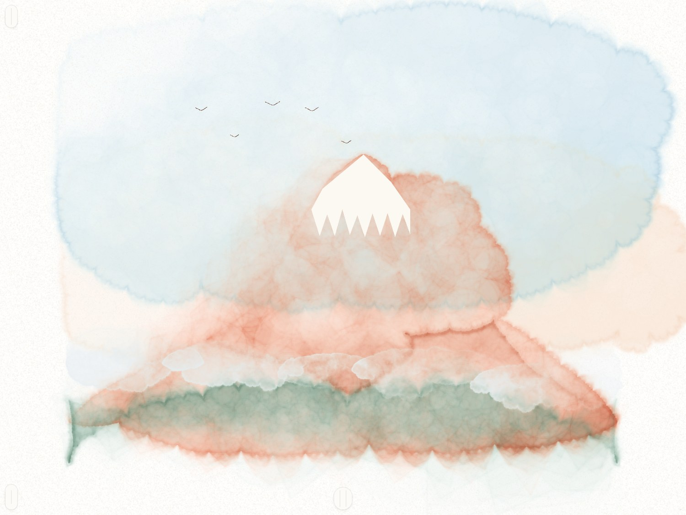
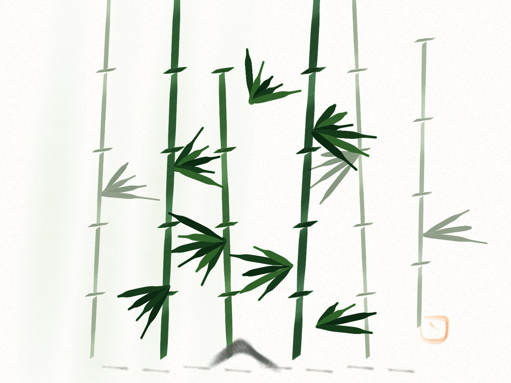
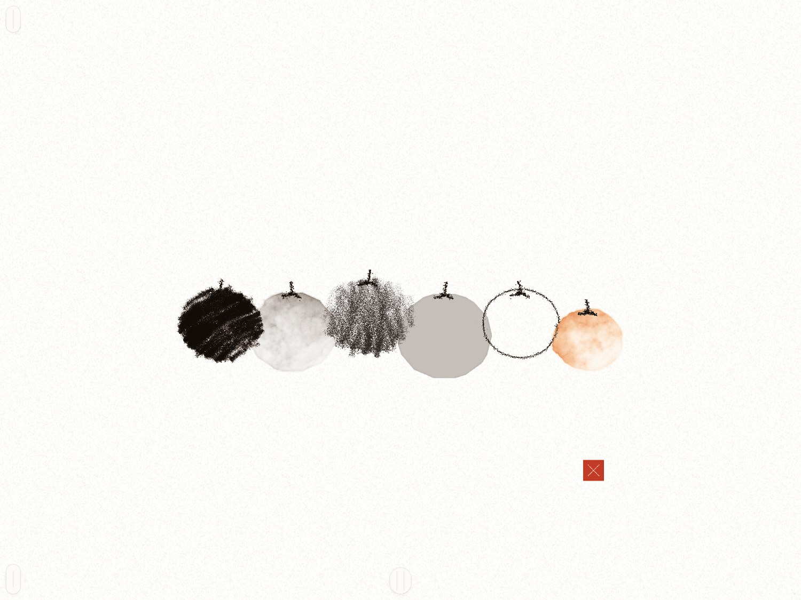
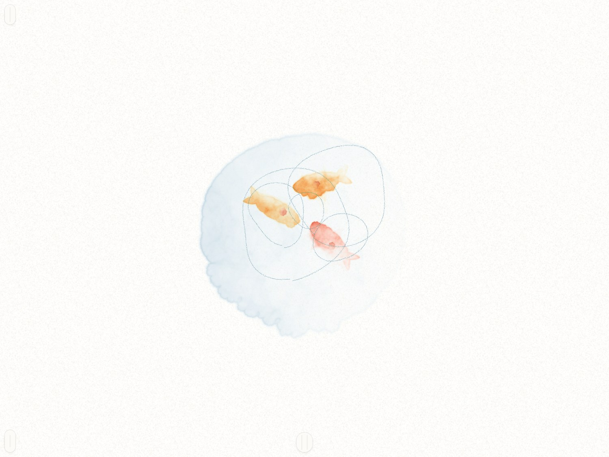

# p5.brush Realtime Studio

A real-time freehand drawing canvas rendered by the actual
[p5.brush](https://github.com/acamposuribe/p5.brush) 2.2.2 engine (standalone build, installed
from npm), with a drawing course beside it. Strokes drawn with a mouse, finger or Apple Pencil
are turned into `brush.Plot`s and stamped by p5.brush with the registered custom brush, so the
result matches `brush.line()` and `brush.spline()` in a p5 sketch.

Built with Vite, React, TypeScript, Tailwind CSS and shadcn/ui, with a tldraw-inspired
interface: tool dock at the bottom, quick actions top-left, style panel top-right. WebGL2 is
required.

| | | | |
|---|---|---|---|
|  |  |  |  |

## Quick start

```bash
cd p5brush-studio
npm install
npm run dev      # local dev server
npm run build    # production build in dist/
npm test         # headless regression suite against dist/
npm run test:build   # build, then run the suite
```

The suite drives the built `dist/` with Playwright's Chromium, serving it from a temporary
local port. Chromium needs `npx playwright install chromium` once.

## Two modes

A first visit lands on the **Learn** path; the free **Sketch** canvas is one tap away, and
returning visitors land where they left off. Routes live in the URL hash (`#/sketch`,
`#/learn`, `#/learn/1.2`, `#/learn/1.2/perform`, `#/warmup`, `#/progress`), so the back button
works and links can be shared.

## Sketch

### Canvas and navigation

The canvas is infinite. Pinch to zoom and drag with two fingers to pan; with Pencil-only on,
one finger pans and the Pencil draws, and the first Apple Pencil touch turns Pencil-only on.
Two-finger tap undoes, three-finger tap redoes. On a desktop, scroll pans, pinch or
ctrl-scroll zooms at the cursor, middle-drag or space-drag pans, `0` resets the view and `F`
fits the drawing. Strokes are stored in world units, so zooming re-renders them exactly.

### Input conditioning

Input is conditioned the way tldraw does it: pen and finger samples closer than a screen pixel
are folded into the previous point (keeping the higher pressure), the first few jittery samples
of a stroke are dropped, pen pressure is eased in instead of starting on the raw spike, and
finger and mouse strokes get simulated pressure from speed, so slow is heavier. Conditioning
runs at render time from the stored input kind, so old drawings are untouched. When the canvas
is rebuilt by an undo, a zoom or a reload, strokes outside the viewport are skipped.

Hand-drawn strokes are stamped chunk by chunk as they arrive and committed exactly as
previewed: the chunk boundaries are stored with the stroke, so undo, zoom, reload and the
sketch export replay the identical stamps and nothing changes when the pen lifts. All chunks of
a stroke share one engine mask and are mixed with the image from before the stroke, so a chunk
boundary leaves no mark in the ink.

### Brushes

Eighteen presets ship: chisel marker, fine liner, graphite pencil, watercolor wash, calligraphy
nib, dry bristle, brush pen, flat shader, ballpoint, charcoal stick, spray stipple, and seven
from the Sixteen Washes page. Those seven are p5.brush's own pen, 2H, 2B and coloured pencil,
its `default` stamp family, so a template can be any p5.brush brush type and not only a custom
tip, plus the page's three custom tips: petal (an oval that turns with the stroke and swells
under pressure), culm (a flat edge held across the stroke) and leaf (a pointed oval, thin where
you land, wide through the middle, a point where you lift).

Previews are rendered by the engine itself. The `brush.add(...)` parameters can be edited live,
a spec can be pasted in from the Brush Maker, and the drawing copied back out as a p5.js sketch.

### Shapes and the Shape tool

Besides strokes the engine renders p5.brush shapes: `brush.fill` with bleed and texture, flat
`wash`, `hatch` and `mass` on a closed polygon, as records of their own that undo, save, replay
and export like strokes.

In Sketch they are the **Shape tool** (`F`). Close an outline and lift, and it lands as the
fill, wash, hatch or mass set in the style panel, in the studio colour. The panel carries the
page's recipes as presets, among them red bleed, sky wash, night, glow, lantern body, paper
wash, charcoal mass and rotring hatch, so any of the sixteen washes can be repainted by hand.

### Saving and export

The drawing and settings autosave to `localStorage` and are restored on the next visit. New
sketch (`C`) starts over with an empty drawing and history, and an undo right after brings the
previous sketch back until the next stroke. Escape cancels the stroke in progress, and a size
cursor shows the brush or eraser footprint.

### Pencil

The Pencil tab of the style panel holds the input smoothing (Kalman filters on position,
pressure, tilt and roll, with one-tap presets and the q/r parameters under Advanced), the hover
footprint, the predicted tail and a pressure calibration. Nib direction, tip follows stroke or
pencil lean like a broad nib, and Pencil Pro barrel roll belong to the brush and sit in the
Brush tab; presets bring their own. The calligraphy nib and the flat shader turn with the
pencil, the ballpoint uses responsive smoothing, and the brush pen keeps force changes light.

Pen samples record altitude, azimuth and twist, and every stroke keeps the effects and filter
parameters it was drawn with, so replays never depend on the current settings. A record without
parameters replays with the pre-filter behaviour.

### Pencil lab

Experimental features stay behind switches in the Pencil lab: tilt shading (a flat pencil makes
a wider, lighter mark), the raw-input overlay and the full per-channel filter card. Open the lab
with `?lab=1` in the URL, or build it in with `VITE_PENCIL_LAB=1`.

### Phone and tablet

On a phone the same interface rearranges itself: the style panel becomes a bottom sheet that
slides up under the dock (drag the handle down, or flick it, to close), the practice picker and
help open as sheets too, the help button moves into the main menu, and fixed chrome keeps clear
of the notch and the home indicator. Touch targets grow on touch-first devices and hover styles
apply only where a pointer can hover. Held sideways, the lesson card moves to a left column so
the drawing keeps the height.

### Motion

Motion follows one small set of rules. Keyboard shortcuts (`P`, `L`, `?`, `Esc`) change the
interface with no animation, popovers and tooltips scale out of the control that opened them and
open instantly once one is showing, presses squeeze the button by 3%, and only the rare moments,
a lesson card appearing or the stars at the end, spend any motion beyond that. Reduced-motion
settings keep the fades and drop the movement.

## Learn

### The path

Learn (`L`, or the graduation-cap button) is a winding path of missions in level colours. One
skill per mission, and each mission is a short lesson (slides with the idea, a cue, and demos
the engine draws with the real brush, the right way and the wrong way), a generated drill, a
guided piece traced with the full guide, then the same piece performed with less guide for
stars. A three-minute warm-up of lines, arcs, ellipses and waves sits on the path.

### Scoring and the guide

Every stroke is scored on shape, length, direction, pressure profile, speed and confidence (one
pull, no hesitation). The pill only speaks when a dimension is out of band, and always with an
instruction: "Press harder at the end", "Slower", "Start at the dot". The guide fades as you
improve, from full to centreline to dots to blind, steps back up after two misses and offers a
three-stroke loop. Perform gives three tries and a critique at the end with the costliest
strokes, the dimension that cost the most, and your first Perform of that piece next to today's.

Short synthesized sound cues (a note per clean stroke, pitched by the score; a chime and star
notes at the results; a tock when the lesson's pen lands) can be turned off from the Learn
header. Progress is local, and older bests migrate.

### Levels

Levels 0 to 5, 7 and 8 are built. Level 6 has 6.1 and 6.2, and its last two missions show as
"soon".

**Level 4 is not tracing.** A blind contour hides the ink until you lift, the negative-space
piece paints around a chair that is never drawn, the portrait is copied upside down, and the cup
is drawn from a ten-second look.

**Levels 7 and 8 are the Sixteen Washes**, the sixteen p5.brush studies of that page (Red Fuji,
Lantern Night, Bamboo, Six Persimmons, Mandala, Koi Pond, Harvest Moon, Seabed Star, Poppies,
Ridge, Marigold Vase, Wheat, Sun, Trade Winds, Jellyfish, Leaf) ported shape by shape from their
recipes. A fill is a step you trace as its outline: close the shape and lift, and the wash
lands, bleeding out or in as the page had it. The page's random is a seeded generator, and its
flow fields and hand wiggle are baked into the reference points. Each mission drills its move
first (bleeding fills, glow and body, six inks, wedges, ridges, hatched shapes, wobbly stalks,
streaks) and its lesson shows the fills landing on the paper.

## Gallery

`docs/gallery/` holds nine studies drawn by the engine itself with the lesson methods
(superimposed lines, one-motion waves, corners as full stops, tapers and swells, wash before
line, far to near), one per brush family, plus the sixteen washes rendered from their lesson
steps exactly as a perfect run draws them.

Both renderers drive a built studio served on port 8768:

```bash
npm run build
npx http-server dist -p 8768 -s &
node tools/draw-gallery.mjs      # the nine studies
node tools/render-studies.mjs    # the sixteen washes, or pass ids
```

## Project layout

| Path | What lives there |
| --- | --- |
| `src/engine/` | The framework-free engine. `Studio.ts` drives p5.brush, `StudioGL.ts` adds paper, snapshots and the eraser, `records.ts` holds stroke and shape records, `templates.ts` the brush presets, `tipShim.ts` emulates the p5.Graphics tip surface, `filters.ts` and `pencil.ts` the input conditioning. |
| `src/practice/` | The course as data: `curriculum.ts` (levels, missions, drills), `lessons.ts` and `washes.ts` (pieces), `teach.ts` (lesson slides), `score.ts`, `progress.ts`, `geometry.ts`, `routes.ts`. |
| `src/components/` | The React interface, with `practice/` for the course screens and `ui/` for the shadcn primitives. |
| `src/hooks/`, `src/sound/` | Interface hooks and the synthesized cues. |
| `tests/` | `e2e.mjs`, the headless regression suite. |
| `tools/` | Gallery renderers. |
| `docs/` | The curriculum plan, the UX spec and the gallery images. |

## Docs

- [`docs/curriculum-plan.md`](docs/curriculum-plan.md) — the whole course, level by level.
- [`docs/practice-ux.md`](docs/practice-ux.md) — the UX spec for the practice screens.
